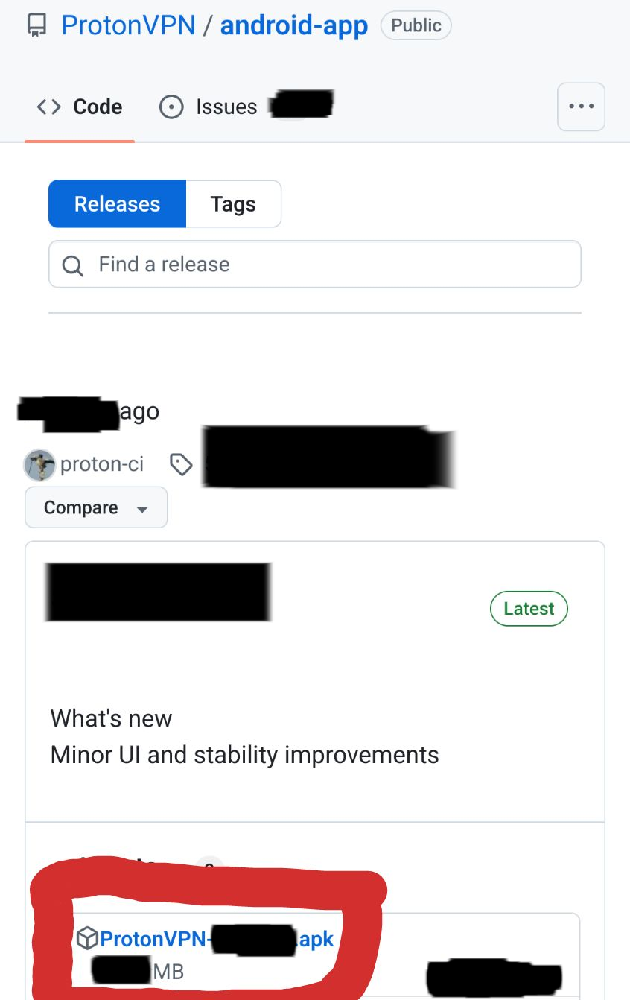
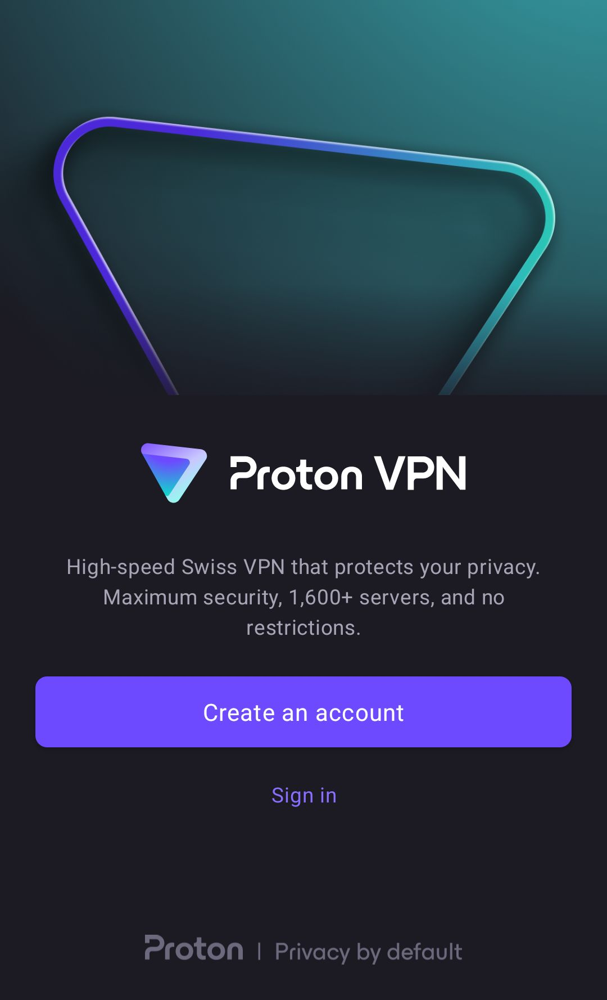
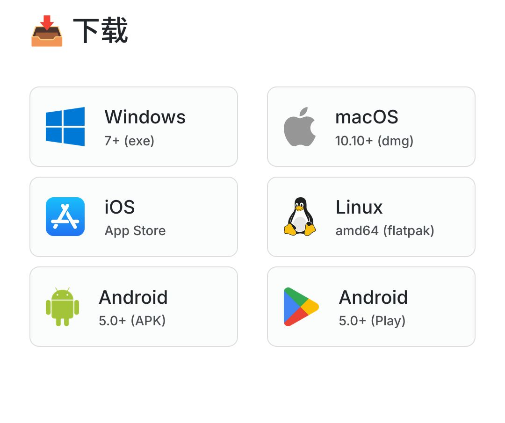
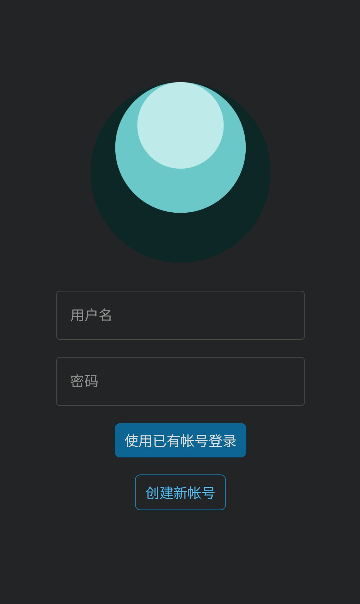
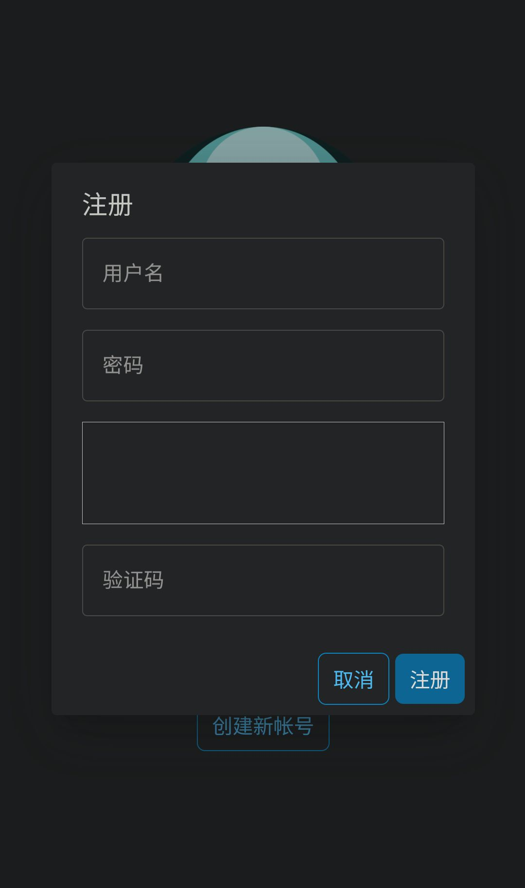

# Proton VPN 和 Geph VPN

---

## 1. ProtonVPN

### 1.1 支持的操作系统

手机端：Android、iOS

电脑端：Windows、macOS、Linux

### 1.2 介绍

ProtonVPN 是由瑞士公司 Proton Technologies AG 运营的 VPN 服务提供商，在瑞士法的保护下在瑞士日内瓦的 Proton 公司总部运营，是目前全球最大的 VPN 提供商，承诺不收集个人信息。ProtonVPN 的使用相对比较简单，登陆后即可使用， ProtonVPN 免费版的速度足够支持大部分日常使用。

> **注意**: 鉴于 Proton 旗下的 Mail 业务曾经在**欧洲刑警组织**和**瑞士法院**要求下公布过某些用户的信息，因此对该公司的 VPN 业务安全性持**保留意见**。

### 1.3  软件安装

> **注意**: 不要使用 **华为手机** 下载这类 VPN 进行翻墙。该系统手机已被当局监控，且已有先例。请立即更换其他品牌手机！

#### Android 系统

> Andriod 手机的安装方法比较多样，可以根据实际情况来选择

- **F-driod**

在应用 *F-droid* 上搜索 ProtonVPN ，然后点击安装即可自动完成下载安装。

- **GitHub**

> 如果没有 F-driod 可以使用此方法

GitHub 下载可能需要翻墙，在保证可访问性后，访问[此链接][1][^1]，然后进入 GitHub 的 *Releases* 界面，下滑找到最新版本，下载 `ProtonVPN - 版本号.apk` ，下载后安装即可。

#### iOS 及 iPadOS 系统

- **App Store**

如果要在 iPhone 或 iPad 上安装 ProtonVPN，需要使用非中国大陆地区的 Apple ID 登录 App Store。

切换 Appple ID 的方法如下：

1. 打开“App Store”
2. 点击右上角的头像
3. 滑到底部，点击“退出登录”
4. 滑到顶部，输入 Apple ID 登录

在切换完毕之后，重新进入 App Store, 在搜索框中搜索 Proton VPN 并点击安装。

#### 电脑端

> **注意**: 由于 Windows，macOS，Linux 安装下载过程类似，即都可通过 GitHub 下载，故合并在一起，不同之处请自行探索。

- **GitHub**

GitHub 下载可能需要翻墙，在保证可访问性后，访问[此链接][2][^2] ，进入其 GitHub 页面，根据电脑系统选择相应的仓库，然后在对应仓库的 Releases 中下载安装包。

当然也可以通过下列的**快捷跳转链接**来访问对应仓库

- [Windows 仓库][4][^4]
- [Linux 仓库][5][^5]
- [macOS 仓库][6][^6]

#### 使用

> 由于ProtonVPN不同客户端的使用方法极其相似，故将不同系统客户端的使用教程合并

进入 ProtonVPN 的客户端，可以看到如下界面

在正式使用前，需要注册一个**匿名的** Proton Mail 账号。如果事先没有注册，则点击软件主界面中的 `Create an account`，然后点击 `Get a new encrypted email address` ，注册 Proton Mail 账号后即可正常使用（请确保该 Proton Mail 账号的匿名性和安全性！请勿**泄漏**账号密码！请勿使用任何**个人信息**注册！请勿使用**国内邮箱**注册！）

如果此前已经拥有**匿名的** Proton Mail 账号，只需直接点击 `Sign in` 登录即可，在登录好之后点击 `Connect` 即可建立 VPN 连接。

---

## 2. 迷雾通 Geph

### 2.1 支持的操作系统

手机端：Android、iOS

电脑端：Windows、macOS、Linux

### 2.2 介绍

迷雾通整个软件架构全开源，使用零知识证明（保证无法收集个人信息），支持 XMR 支付；迷雾通的注册公司在爱沙尼亚，受欧盟法律监管，且其维护者与当局有矛盾，可以保证暂时的安全性。

> **注意**: 迷雾通需要注册登陆账号才能使用，不过注册方法及其简单，但免费账号的速度较慢，无法满足流畅播放视频。且迷雾通有过短暂**被封锁**的历史

### 2.3 软件安装

#### 下载安装

- **官网下载**

> 迷雾通在 Android，windows，macOS，Linux 等平台安装下载过程类似，都可通过**官网**下载，故合并在一起，不同之处请自行探索。

官网下载需要翻墙，在翻墙后，访问[此链接][3][^3] ，然后会进入迷雾通的官网页面，下拉找到下载，根据所使用的设备选择对应的安装包下载，下载后根据自己设备的具体情况进行安装。

- **App Store**

如果要在 iPhone 或 iPad 上安装 Geph，需要使用非中国大陆地区的 Apple ID 登录 App Store。

切换 Appple ID 的方法如下：

1. 打开“App Store”
2. 点击右上角的头像
3. 滑到底部，点击“退出登录”
4. 滑到顶部，输入 Apple ID 登录

在切换完毕之后，重新进入 App Store, 在搜索框中搜索 Geph 并点击安装。

#### 使用教程

> 由于迷雾通不同客户端的使用方法极其相似，将不同系统客户端的使用教程合并

进入迷雾通客户端，可以看到登陆界面，如果此前注册过迷雾通账号，可以直接使用已有账号登陆

如果没有账号或忘记账号密码，那就需要注册迷雾通账号，接下来点击创建新账号，然后可以看到以下界面

输入账号密码后，需要输入验证码，最后点击注册，注册完成之后就可以登陆了

> **注意**: **验证码**可能会因为**网络问题**而无法显示，此时可采取更换网络环境、修改 DNS 或事先使用其他 VPN 等方式来完成注册

登陆成功后，在软件主界面选择 VPN 节点，然后点击连接即可。

> 如果需要购买付费账号，请仔细了解和学习 Geph 官方提供的**付款方式**，确保**财产**和**个人信息**安全后再进行购买

[1]: https://github.com/ProtonVPN/android-app/releases
[^1]: https://github.com/ProtonVPN/android-app/releases

[2]: https://github.com/ProtonVPN
[^2]:https://github.com/ProtonVPN

[3]: https://geph.io
[^3]: https://geph.io

[4]: https://github.com/ProtonVPN/win-app
[^4]: https://github.com/ProtonVPN/win-app

[5]: https://github.com/ProtonVPN/proton-vpn-gtk-app
[^5]: https://github.com/ProtonVPN/proton-vpn-gtk-app

[6]: https://github.com/ProtonVPN/ios-mac-app
[^6]: https://github.com/ProtonVPN/ios-mac-app
