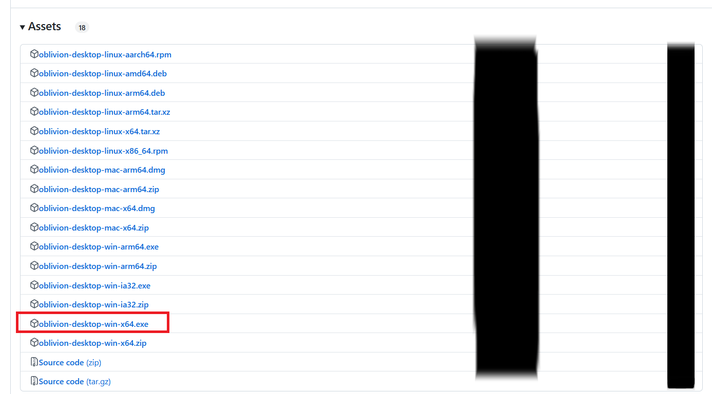

# WARP 系 VPN 使用教程

**WARP 系** 是一个专有名称，指的是基于 CloudFlare 的 VPN 软件 WARP 以及衍生出的二次开发的开源软件。

> **注意**: 该系列 VPN 经测试，在中国大陆大部分地区暂不可用，若有需要建议优先尝试其他 VPN。

## 1. CloudFlare WARP

### 1.1 支持的操作系统

- 手机端：Android、iOS
- 电脑端：Windows、macOS、Linux

### 1.2 介绍

该软件曾是极其好用的 VPN，实力强劲，速度是基于公司的梯子中最快的一个，但不知为什么不能访问 Google Play。可以使用某些 Telegram 频道中的激活密钥获取大量流量使用，可满足日常需求，甚至可以用它来看油管特高分辨率的视频。但是在中国大陆地区已经遭到大规模封禁，最近新发布了 MASQUE 协议，多处报告可用，似乎有复活的迹象，与传统 VPN 不同的是，它结合了 Cloudflare 的全球边缘网络。

### 1.3 获取途径

- Android手机端：在 Aurora Store 搜索 WARP 下载
- 通用下载渠道：点击[此处][1][^1]跳转到 WARP 官方下载地址

### 1.4 安装和使用教程

下面以 Windows 平台为例介绍从官网下载安装的方法，其他平台操作类似

通过上文所述链接跳转到如下界面，并单击红框部分（其他操作系统需下滑寻找对应的版本）

之后便跳转到该页面

> 经测试，这一步可能需翻墙才能成功访问

下载完成后直接打开该文件看到安装引导界面

依次单击 next 和 install

> 若出现安全提示，点击`允许该应用修改计算机`

看到如下页面即为安装成功

Windows 端的 WARP 在右下角的小图标中，以下是应用打开后的界面

点击中心的按钮进入如下状态

经过测试，**大部分地区**会卡在正在连接， VPN 没有实际效果

---

## 2. Oblivion

### 2.1 支持的操作系统

手机端：Android

电脑端：Windows、macOS、Linux

### 2.2 介绍

除了使用 CloudFlare 的网络服务之外，其余全部开源，但目前仍未适配 MASQUE 协议，可能会出现连不上的情况，可以不必自备密钥，可以选择 IP，这是 WARP所不具有的。四端应用，速度基本和 WARP 一样快，但由于未适配 MASQUE 协议，可能会出现连不上的情况，这是由地区上的 GFW 的情况决定的，需要自行尝试。

### 2.3 获取途径

- 前往 GitHub 进行下载，点击[此处][2][^2]跳转

### 2.4 安装和使用教程

以 Windows 端为例

单击上文链接跳转至如下界面

下滑至该界面，根据自身操作系统，单击对应的下载按钮（如红框中所示）

在该界面单击选择对应的文件进行下载

之后进入安装引导界面，选择合适位置安装即可

应用启动后为如下界面

单击中心按钮即可

经过测试，和 WARP 的情况类似，始终卡在 `Connecting` 状态，VPN 没有实际效果。

[1]:https://developers.cloudflare.com/cloudflare-one/connections/connect-devices/warp/download-warp/
[^1]:https://developers.cloudflare.com/cloudflare-one/connections/connect-devices/warp/download-warp/

[2]:https://github.com/bepass-org/oblivion-desktop?tab=readme-ov-file
[^2]:https://github.com/bepass-org/oblivion-desktop?tab=readme-ov-file
