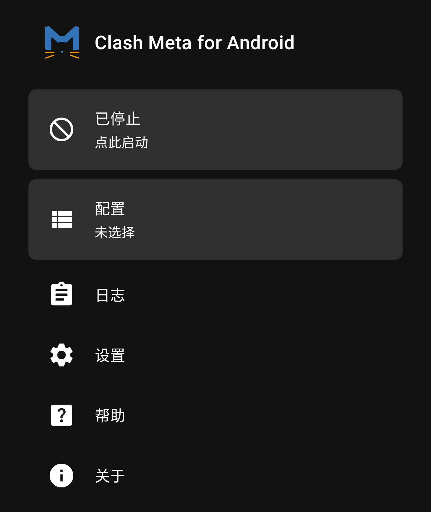
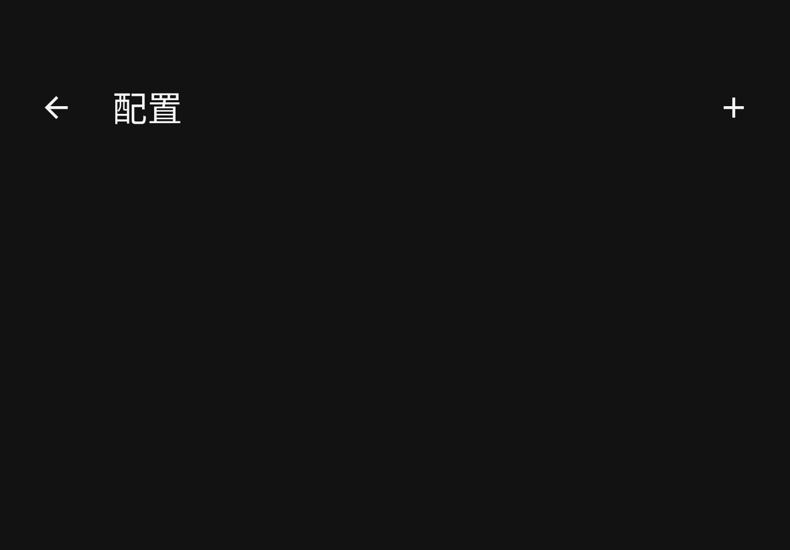
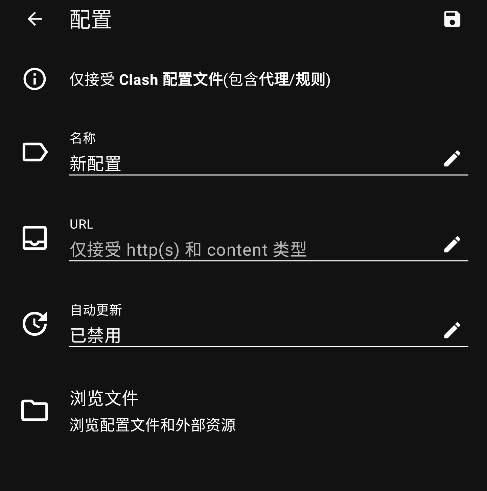
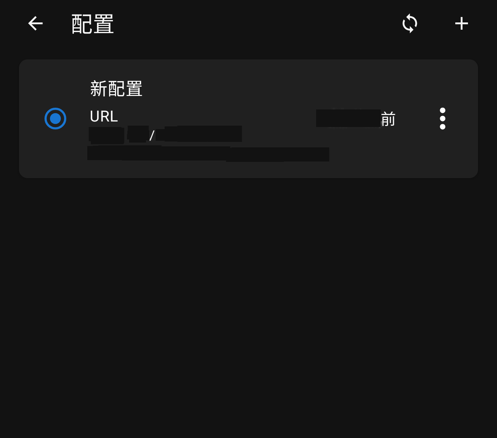
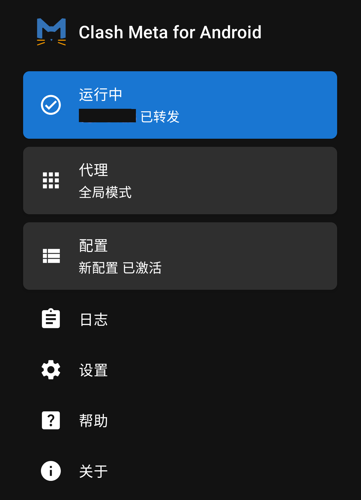
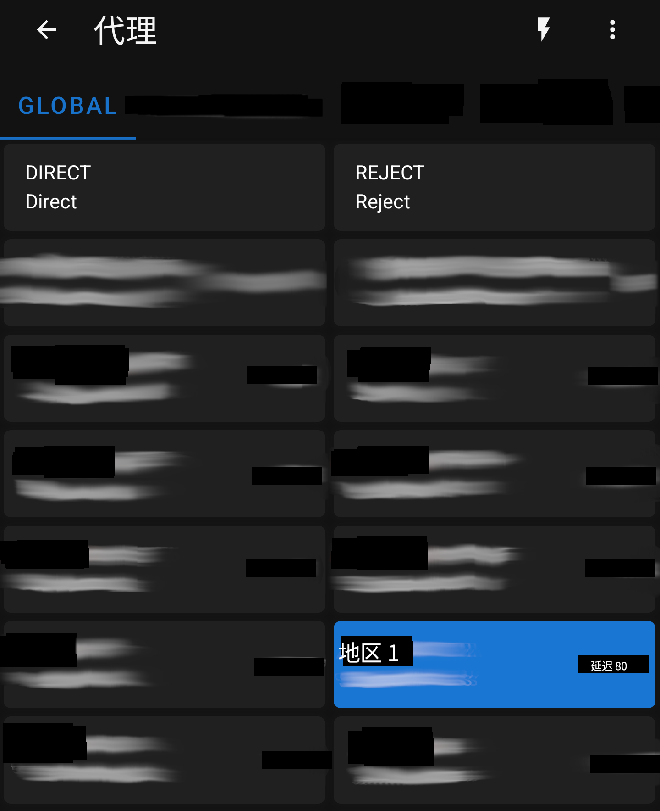
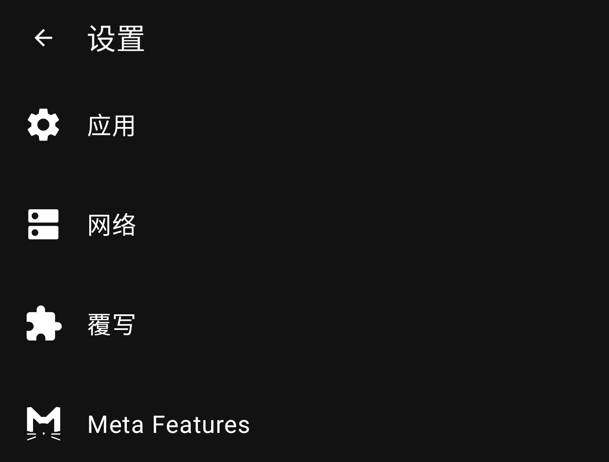
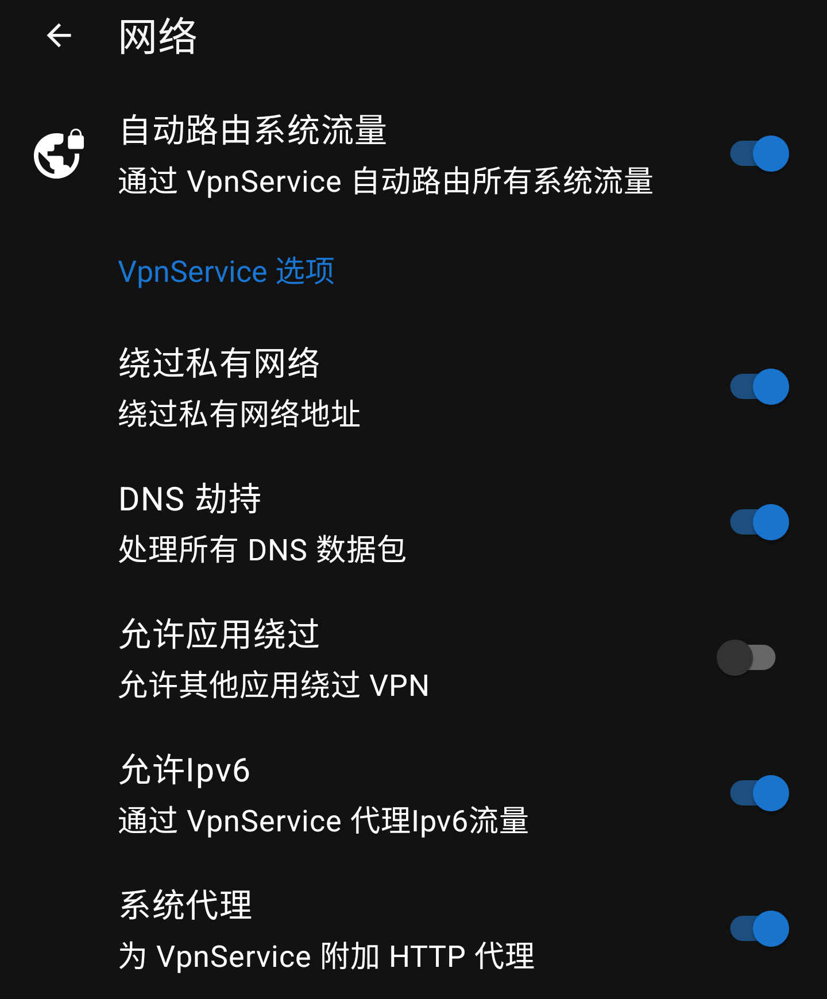
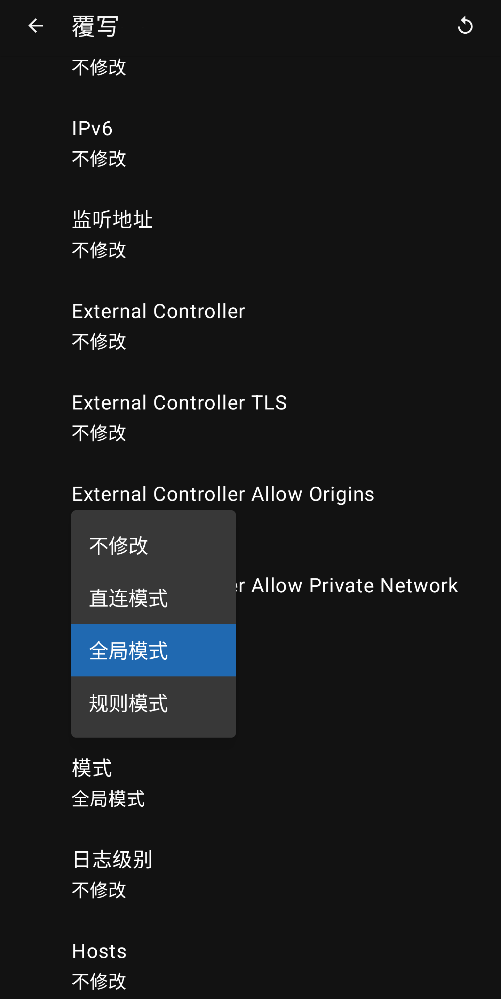

# Clash Meta for Andriod

如标题所写，本软件仅适用于运行 Andriod 系统的设备，是基于 [Clash.Meta(mihomo)][1][^1] 内核的 [Clash For Andriod][2][^2] 二次开发版本。
> **注意**: Clash For Andriod 及其使用的内核目前均已停止维护，出于安全的考虑，请不要使用

此外，该软件的界面风格几乎和原项目一致，曾经使用过此类软件的用户可以很快上手。

## 1. 下载安装

该软件提供 [F-Driod][3][^3] 一键安装，还可以管理后续的更新，推荐使用该方式进行快速安装。

> 以上方式需要通过应用 F-Driod 进行，需要提前安装**该应用**才能保证下载的正常进行，请参阅 [F-Driod 官网][4][^4]。

另一种方式是通过 GitHub 仓库的[发布地址][5][^5]进行下载，下载时需要注意以下事项：

- 选择最新发布版本(Latest)进行下载，而不是测试(Pre-release)版本。

- 选择正确的系统架构，如果清楚怎么选择，可以选择带有 `universal` 字样的**通用安装包**。

下载完成之后安装该应用并授予相应权限。

---

## 2. 使用教程

### 2.1 获取订阅链接

参见文章 《**机场订阅教程**》

### 2.2 导入订阅链接

首先打开软件，在软件的**主界面**中找到 `配置` 按钮（下方说明为：**未选择**），点击**该按钮**以进入**配置菜单**。

点击该界面右上角的**加号** `+`，然后选择 `URL` 以创建一个基于**订阅链接**的新配置。

在 **配置** 界面中的 `URL` 一栏，粘贴上一步中获取的**订阅链接**，然后按需对 `名称` 和 `自动更新` 进行自定义。

待一切都完成之后，再点击右上角的保存按钮 `💾` 保存配置，等待与服务器通信获取配置文件。

处理完上述步骤后，还需要**启用**刚刚保存的新配置。回到最初的**二级菜单**，点击新配置左侧的**复选框**，待其变为深蓝色后，配置就成功启用了。

### 2.3 配置代理规则

在软件的主界面，有一个状态按钮，显示的内容为 `已停止` 其下方的说明：**点此启动**，点击该按钮，此时会显示为 `运行中`，这样就成功的**启动**了代理，系统会弹出建立 VPN 的请求，同意即可。

然后点击下方的 `代理`，来到代理规则页面，点击右下角的**测速按钮** `⚡`，选择延迟**较低**的节点。

> **注意**: 为了确保安全，请无视掉**港澳地区**的任何节点，除非其他节点测速结果非常差（延迟大于 800），此时可以**临时选择**。

### 2.4 额外设置

再次来到软件的主界面，先停止代理（点击 `运行中` 按钮），然后点击 `设置`，来到软件的高级设置页面。

接着，进入 `网络` 页面中，关闭 `允许应用绕过` 开关并确认其他开关均处于**打开状态**。

最后，在 `覆写` 页面中，找到**常规**部分的 `模式` 选项，将其配置由 `不修改` 改为 `全局模式`。

在完成以上的所有操作后，**不要忘记**回到主界面，再次**启动**之前关闭的代理，最后的主界面显示内容应该如下图所示：

---

## 注意事项

- 若使用 Lineage OS，请在 `系统设置 - 网络和互联网 - VPN` 启用 `始终开启的 VPN` 和 `屏蔽未使用 VPN 的所有连接` 选项

- 不定时的进行节点**测速**并更换质量较好的节点

- 定期检查是否处于**全局代理**模式

[1]: https://github.com/MetaCubeX/Clash.Meta
[^1]: https://github.com/MetaCubeX/Clash.Meta

[2]: https://github.com/xuhaoyang/ClashForAndroid
[^2]: https://github.com/xuhaoyang/ClashForAndroid

[3]: https://f-droid.org/packages/com.github.metacubex.clash.meta/
[^3]: https://f-droid.org/packages/com.github.metacubex.clash.meta/

[4]: https://f-droid.org/
[^4]: https://f-droid.org/

[5]: https://github.com/MetaCubeX/ClashMetaForAndroid/releases
[^5]: https://github.com/MetaCubeX/ClashMetaForAndroid/releases