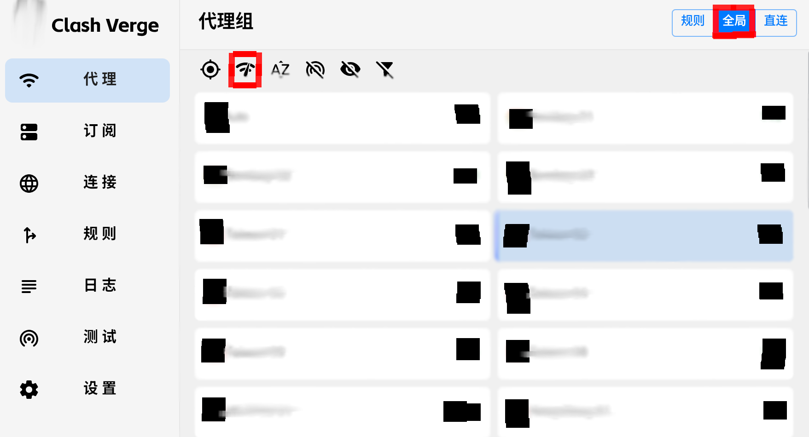

# Clash Verge Rev

本软件适配 Windows, MacOS, Linux 三种类型的操作系统，同时继承了原 clash-verge 的界面风格，并使用了尚在维护状态的 [Clash.Meta(mihomo)][1][^1] 内核以保证安全性。

> **注意**: 原 Clash for Windows, clash-verge 的源代码已**停止维护**，极其不推荐使用。

## 1. 下载安装

请访问[该页面][2][^2]以获取最快捷方便的安装体验。

> **注意**: 请**仔细阅读**该网站内的各种**提示说明**和**注意事项**，这非常重要，会影响到安装的成功与否。

为了预防因**粗心大意**导致的安装错误，在此提前列出需要注意的点:

- Windows 7 系统用户需要查看网页中提到的**FAQ**

- 使用搭载 Apple Silllion 芯片(M 系列)电脑的用户需要注意**系统架构**

- Linux 用户需要注意选择与**发行版**相对应的安装包

- Ubuntu 用户需要检查版本，某些特定版本需要安装网页中提到的**额外依赖**

---

## 2. 使用教程

在一切开始之前，请大致阅读并了解该软件的[常用名词][3][^3]

### 2.1 获取订阅链接

参见文章《**机场订阅教程**》

### 2.2 导入订阅链接

首先打开软件来到主界面，然后点击左侧边栏中的 `订阅` 按钮，打开订阅管理界面。

然后在 **订阅文件链接** 处粘贴刚才获取的**订阅链接**，粘贴完毕后点击 `导入` 即可。

### 2.3 配置代理规则

在左侧边栏选择 `代理`，来到如下界面

首先点击右上角高亮的 `全局` 按钮，然后点击**代理组**下方红色方框圈出的 `测速按钮` 进行测速，之后再选择一个延迟较低的节点，至此代理规则就成功设置完毕了

> **注意**: 为了确保安全，请无视掉**港澳地区**的任何节点，除非其他节点测速后均显示 **Error**，此时可以**临时选择**。此外，如果没有特殊需求，尽量选择**全局模式**，以提高安全性。

### 2.4 额外设置

选择左侧边栏的 `设置`，将 `系统代理` `开机自启` 等选项打开，
然后 **安装** 并 **启用** `服务模式`，最后将 `TUN 模式` 和下方的 `IPv6` 选项打开。

> **注意**: `v2.0.0` 版本后，`服务模式` 会自动安装，只需打开 `TUN` 模式即可

以上步骤完成之后，整个**设置界面**应该和上图一致。

> 此教程仅简单地介绍了一些基本操作，想要更细致的了解高级用法，请参阅官网的[使用教程][4][^4]

---

## 注意事项

1. 如果遇到了任何问题，请首先访问该项目网站中的[常见问题][5][^5]页面。

2. 保持该软件的更新，时常访问该软件的[发布地址][6][^6]检查最新发布版本（Lateset 字样），
   或是通过软件自带的 `检查更新` 按钮实现更新（在 **设置** 菜单中可找到）。

[1]: https://github.com/MetaCubeX/mihomo
[^1]: https://github.com/MetaCubeX/mihomo

[2]: https://www.clashverge.dev/install.html
[^2]: https://www.clashverge.dev/install.html

[3]: https://www.clashverge.dev/guide/term.html
[^3]: https://www.clashverge.dev/guide/term.html

[4]: https://www.clashverge.dev/guide/profile.html
[^4]: https://www.clashverge.dev/guide/profile.html

[5]: https://www.clashverge.dev/faq/windows.html
[^5]: https://www.clashverge.dev/faq/windows.html

[6]: https://github.com/clash-verge-rev/clash-verge-rev/releases
[^6]: https://github.com/clash-verge-rev/clash-verge-rev/releases
