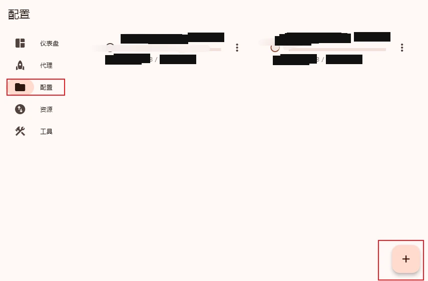
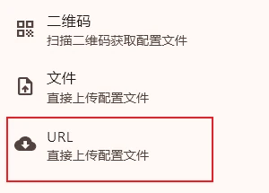
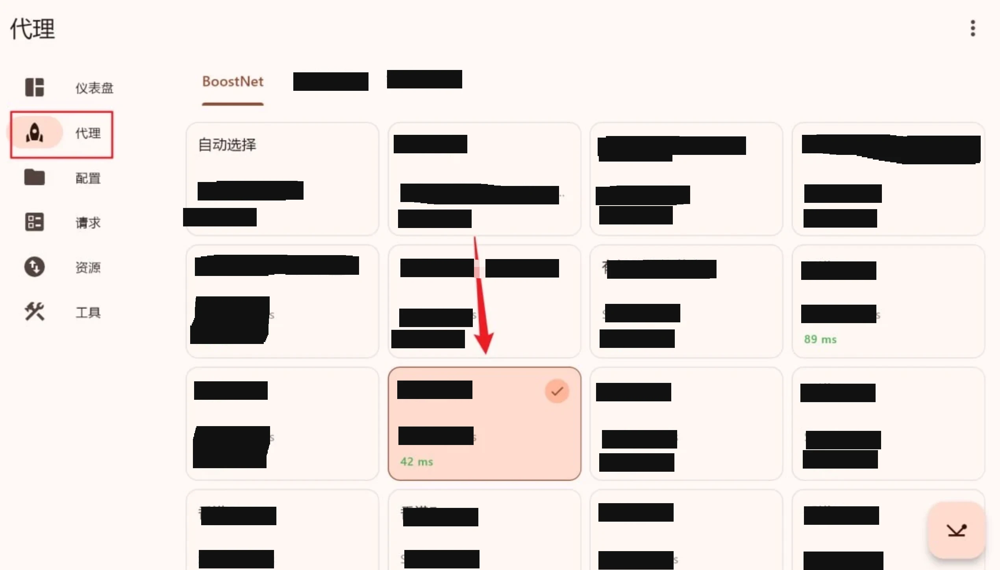
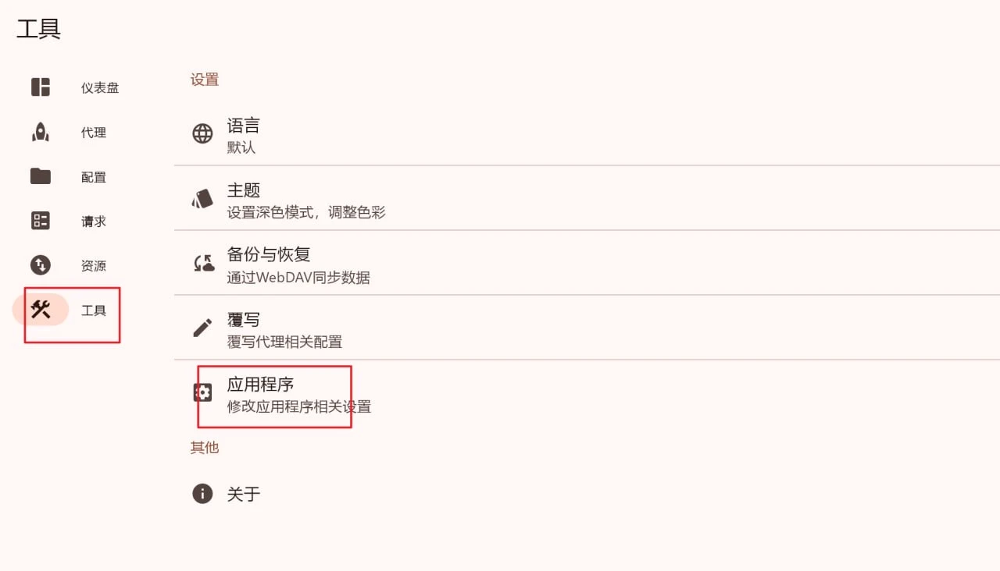
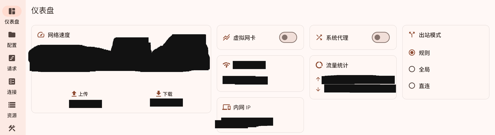

# FlClash

FlClash 是基于 [Clash.Meta(mihomo)][1][^1] 内核的另一个开源多平台客户端，
该软件界面基于 Material You 设计，具有独特的风格，且适配了除 iOS 外所有的主流操作系统。

## 1. 下载安装

Andriod 系统用户可以使用其提供的 [F-Driod][2][^2] 链接一键安装，还可以方便地管理后续的更新，非常推荐使用。

> 以上方式需要通过应用 F-Driod 进行，需要提前安装 **F-Driod** 才能保证下载的正常进行，详情请参阅 [F-Driod 官网][3][^3]。

另一种方式是访问 FlClash 的[教程网站][4][^4]，该页面详细的讲解了如何下载安装。

此外，还可以访问 GitHub 仓库的[发布地址][5][^5]进行下载，下载前请注意以下事项：

- Andriod 系统需要选择与**系统架构**相匹配的安装包，错误的选择会导致软件无法安装
- Linux 系统需要选择与**发行版**相对应的安装包
- 选择最新发布版本(Latest)进行下载

## 2. 使用教程

### 2.1 获取订阅链接

参见文章 [《**机场订阅教程**》](../4/subscribe.md)

### 2.2 导入订阅链接

打开软件，点击 `配置`，进入**订阅配置**界面

在该页面点击右下角的加号 `+`，选择 `URL` ，然后将上一步中获取的**订阅链接**粘贴到文本框中，然后再点击 `提交` 按钮。

### 2.3 选择节点

选择 `代理`，进入节点选择页面，如下图：

程序会默认选择 `自动选择` 这个选项，请**无视掉**它并手动选择一个**延迟较低**的节点。

> **注意**: 为了确保安全，请避免选择**港澳地区**的任何节点，除非其他节点测速后均显示红色的 **Error**，此时可以**临时选择**。此外，如果没有特殊需求，尽量选择**全局模式**，以提高安全性。

### 2.4 额外设置

选择 `工具`，进入应用设置界面，然后点击 `应用程序` 按钮

在展开的**菜单**里检查并**启用**以下选项:

- `退出时最小化`
- `自启动`
- `自动运行`
- `自动关闭连接`
- `自动检查更新`

随后关闭 `应用程序` 菜单，点击 `覆写 - 基础`，检查并其中的 `IPv6` 选项。

最后关闭 `基础` 菜单，点击 `仪表盘`，进入软件主界面

然后开启 `虚拟网卡` 和 `系统代理` 两个选项，再将 **出站模式** 设置为 `全局`

> **注意**: 由于该软件的界面风格统一，且受限于篇幅，此教程仅给出了桌面端的简易使用方法，移动设备端可能会存在一定的变化，遇到**不同之处**还需要自行探索。

---

## 注意事项

- 该软件处于开发初期，用户群体和社区规模还在不断积累，日常使用遇见 bug 的概率比同类软件高，不建议作为主力使用
- 除非熟悉 WebDAV 的原理和使用方法，否则不建议使用软件提供的云同步功能，以减少安全隐患

[1]: https://github.com/MetaCubeX/Clash.Meta
[^1]: https://github.com/MetaCubeX/Clash.Meta

[2]: https://chen08209.github.io/FlClash-fdroid-repo/repo?fingerprint=789D6D32668712EF7672F9E58DEEB15FBD6DCEEC5AE7A4371EA72F2AAE8A12FD
[^2]: https://chen08209.github.io/FlClash-fdroid-repo/repo?fingerprint=789D6D32668712EF7672F9E58DEEB15FBD6DCEEC5AE7A4371EA72F2AAE8A12FD

[3]: https://f-droid.org/
[^3]: https://f-droid.org/

[4]: https://flclash.cc/download.html
[^4]: https://flclash.cc/download.html

[5]: https://github.com/chen08209/FlClash/releases
[^5]: https://github.com/chen08209/FlClash/releases